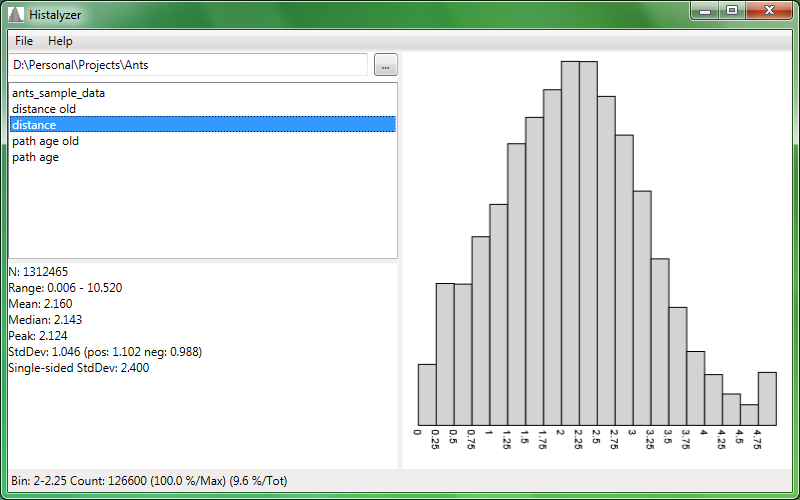

# Histalyzer
Histogram analysis

Requirements: Windows .NET

This is a simple to use, free histogram analysis tool. Using Excel or Libre Office (Calc) it is possible to create histograms in a semi-automated fashion. However, loading large data files (more than 1 million rows) seems to be relatively slow considering the data analysis is straight forward and not computing intensive.

This tool automatically reads a text file (data presented in rows) of an arbitrary length, performs basic statistical analysis, and draws a histogram. Now also support data in columns, with variable bin size and range.
